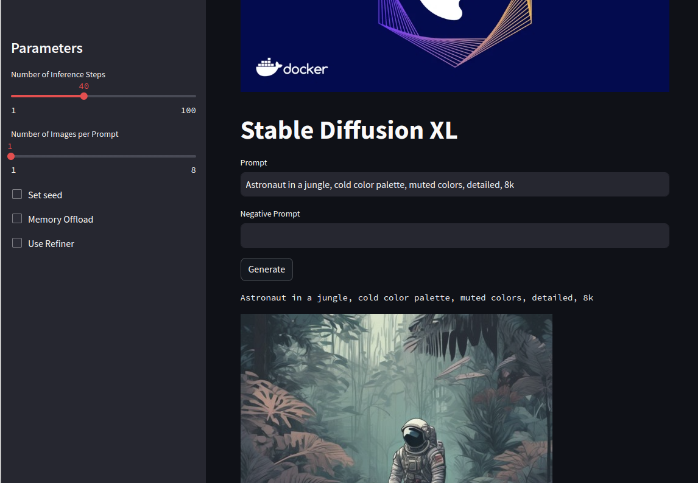

# STABLE DIFUSSION CLIENT IN STREAMLIT

## Why?

This repository offers an out-of-the-box web UI for using stable diffusion. It's designed to be easy to install, allowing you to quickly get started with stable diffusion.

### Take into Account

- **Using Docker**: 
    - This repository uses NVIDIA Docker, enabling the use of GPUs when necessary. GPU usage depends on the arguments you use in the Docker compose. If you intend to use Docker, you will need NVIDIA Docker installed. [Here's a link to NVIDIA Docker installation guide](https://docs.nvidia.com/datacenter/cloud-native/container-toolkit/install-guide.html#docker).
    - Ensure you have at least 12GB RAM in your GPU (for base model).
    - To run the application using Docker, execute the following command: docker-compose up.

- **Without Docker**: 
    - If you do not want to use Docker, it's still possible to run the application. You will need to create a virtual environment, install the requirements located inside the `app/` folder, and then run Streamlit with `app/app.py`.

#### IMPORTANT: The Model Weights

The model uses **two** sets of weights: one for the base and another for the refiner.

Additionally, take note of the `repos_simplified` folder. Within, you will find simplified implementations of other repositories with GUIs for stable diffusion XL.

