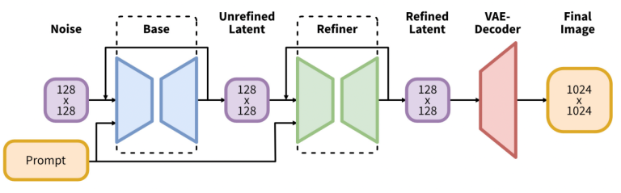
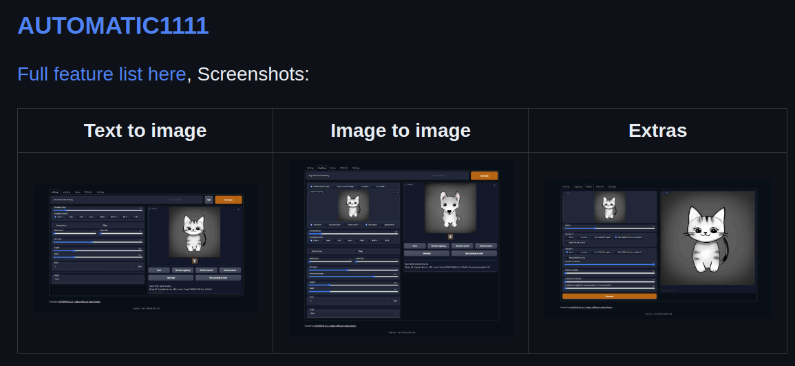
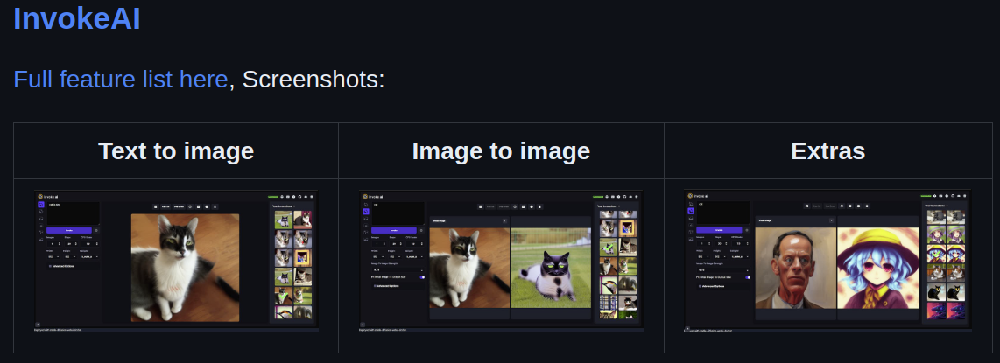
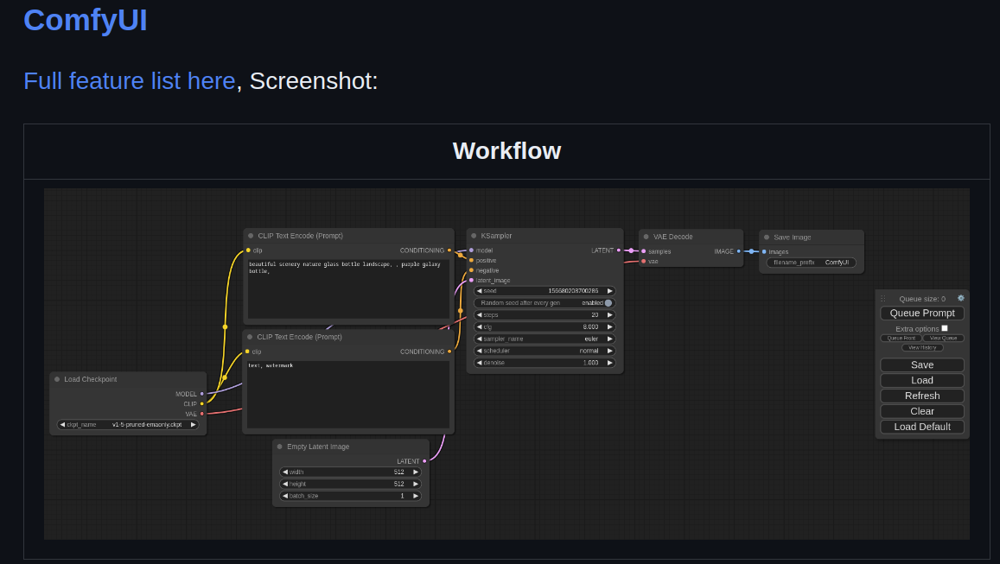

# DOCKER FROM stable-diffusion-webui-docker

**REPO:** [stable-diffusion-webui-docker on GitHub](https://github.com/AbdBarho/stable-diffusion-webui-docker)

## Why?

This repository offers an out-of-the-box web UI for using stable diffusion. It's designed to be easy to install, allowing you to quickly get started with stable diffusion.

### Introducing Simplified Scripts for Running Stable Diffusion XL 1.0

To further simplify the process of running stable diffusion XL 1.0, we are providing shell scripts that automate the setup and download of new weights required to run SDXL 1.0. These scripts leverage the existing Docker files in the repository and make it effortless to set up the system and begin using the models.

## Getting Started

This repository provides four different ways to set up and run the stable diffusion web UI. Depending on your preferences and system requirements, you can choose one of the following scripts:

1. **Automatic with GPU Support (Uses `--api` Flag):** Use the `automatic1111.sh` script if you want to run the automatic profile with GPU support. This option utilizes the `--api` flag in the Docker compose, enabling the corresponding functionality.
2. **Automatic with CPU Support(Uses `--api` Flag):** Use the `cpu_automatic1111.sh` script if you want to run the automatic profile without GPU support, using only the CPU.
3. **Comfy UI:** Use the `comfy.sh` script if you want to set up and run the Comfy UI.
4. **Invoke AI:** Use the `invoke.sh` script if you want to set up and run the Invoke AI profile.

### Take into Account

This repository uses NVIDIA Docker, enabling the use of GPUs when necessary. GPU usage depends on the arguments you use in the Docker compose, as explained in the [Setup Wiki](https://github.com/AbdBarho/stable-diffusion-webui-docker/wiki/Setup).

#### IMPORTANT: The Model Weights
The model uses **two** sets of weights: one for the base and another for the refiner.

From here, you have four ways to proceed: **AUTOMATIC1111**, **CPU - AUTOMATIC1111**, **INVOKEAI**, or **ComfyUI**.

### AUTOMATIC1111
Repo: [AUTOMATIC1111 on GitHub](https://github.com/AUTOMATIC1111/stable-diffusion-webui-feature-showcase)

### CPU - AUTOMATIC1111
Same as before but with CPU, not GPU

### INVOKE AI
Repo: [INVOKE AI on GitHub](https://github.com/invoke-ai/InvokeAI)

### COMFY UI
Repo: [COMFY UI on GitHub](https://github.com/comfyanonymous/ComfyUI)

## What do the scripts do?

Here are the steps to get the stable diffusion web UI up and running:

1. **Clone the repository.**
2. **Create and start the Docker container.**
3. **Download the two required weights.**
4. **Add the two new models into the desired folder.**

That's it! With these steps, you'll be able to use the model, at least for practice.
